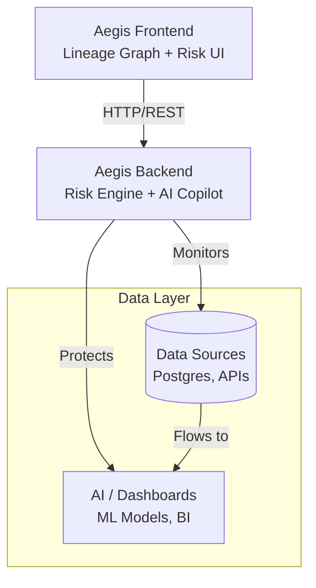

# 🛡️ Project Aegis
### AI Data Resilience & Schema Drift Defense Platform


---
## Links


---

---

## 📌 Overview
**Project Aegis** is a next-generation **data resilience and AI assurance platform** designed to defend modern data pipelines against **silent schema drift** — one of the most common and costly causes of AI model and analytics failures.

Aegis continuously monitors data lineage, simulates schema failures, calculates downstream blast radius, and auto-heals pipelines using AI-generated SQL virtual patches — all without downtime.

---

## ❗ Why This Exists — The Problem
Modern AI systems rely on complex data pipelines across databases, APIs, warehouses, and models. Small schema changes often cause:

* **Silent AI model corruption**
* **Broken dashboards and reports**
* **Incorrect business decisions**
* **Hours to days of debugging**

> **Static pipelines = Fragile pipelines.**

---

## 🚀 Core Innovation: Data Lineage–Driven Risk Engine
Aegis treats data pipelines as a **connected graph**, not isolated tables. By modeling sources, transformations, warehouses, and AI consumers as a dependency graph, Aegis can:

1.  **Predict impact** before failure occurs.
2.  **Measure blast radius** in milliseconds.
3.  **Translate technical failure** into business risk (Data VIX).

---

## 🧮 Data VIX & Risk Metrics
Aegis quantifies technical failure into a single financial risk metric (0.0–100.0) called the **Data VIX**.

$$
VIX = \frac{(\text{Severity} \times 1.5) \times \text{Blast Radius}}{\text{Safe Time}} \times 100.0
$$

### Core Components
* **📉 Data VIX Score:** Clamped between **0.0** (Healthy) and **100.0** (Systemic Failure). A score of **99.0+** triggers a fleet failure alert.
* **💥 Blast Radius:** The total count of downstream nodes (dashboards, AI models) impacted by the specific schema break.
* **⏳ Time Delta (Safe Time):** The duration factor acting as a divisor. Includes defensive logic (`max(time_delta, 1.0)`) to prevent division by zero.
* **⚡ Severity:** A weighted integer based on the magnitude of the break (e.g., number of broken columns), multiplied by **1.5** to prioritize source-level corruption.

### Implementation (Python)
*Logic from `backend/app/services/vix_calc.py`:*
```python
def calculate_vix(severity: int, blast_radius: int, time_delta: float = 0.0) -> float:
    try:
        safe_time = max(float(time_delta), 1.0) # ZeroDivisionError protection
        weighted_severity = float(severity) * 1.5
        raw_score = (weighted_severity * float(blast_radius)) / safe_time * 100.0
        return min(max(round(raw_score, 1), 0.0), 100.0) # Clamp 0-100
    except Exception:
        return 50.0


```

---

## ⭐ Key Features

* 🧠 **End-to-End Data Lineage Visualization** 
* 💥 **Schema Drift Simulation (Chaos Injection)** 
* 📉 **Real-Time Blast Radius Analysis** 
* 📊 **Data VIX Risk Scoring (0–100)** 
* 🤖 **AI-Generated SQL Remediation (Virtual Patching)** 
* 🩺 **One-Click Global Heal** 
* ☁ **Cloud-Native, Scale-to-Zero Architecture** 

---

## 🧰 Technology Stack

| Component | Technology |
| --- | --- |
| **Language** | Python 3.10, TypeScript |
| **Backend** | FastAPI  |
| **Frontend** | React 18 (Vite)  |
| **Visualization** | React Flow  |
| **State Management** | Zustand  |
| **Containerization** | Docker  |
| **Cloud Platform** | Google Cloud Run  |
| **Registry** | Google Container Registry  |

---

## 🏗 Architecture



*(If Mermaid is not supported in your viewer, see the ASCII representation below)*

```text
    ┌───────────────────────────────┐
    │         Aegis Frontend        │
    │  (Lineage Graph + Risk UI)    │
    └──────────────┬────────────────┘
                   │
                   v
    ┌───────────────────────────────┐
    │         Aegis Backend         │
    │   (Risk Engine + AI Copilot)  │
    └──────┬─────────────────┬──────┘
           │                 │
           v                 v
┌────────────────────┐  ┌──────────────────┐
│    Data Sources    │  │  AI / Dashboards │
│  (Postgres, APIs)  │  │  (ML Models, BI) │
└────────────────────┘  └──────────────────┘


```

---

## 🗄️ Schema Example Used for Deployment

To simulate real-world financial data pipelines, Aegis is deployed with a rigorous BigQuery schema structure. This schema is monitored for drift (e.g., unexpected data type changes or column deletions). 


*In the Chaos Simulation, Aegis injects drift by altering these fields (e.g., changing `amount` from FLOAT to STRING) to test system resilience.* 

---

## 📁 Project Structure

```text
aegis-platform/
├── .dockerignore
├── .gitignore
├── README.md
├── deploy_aegis.sh             # Deployment script
├── docker-compose.yml          # Container orchestration
├── schema_diagram.png          # Visual schema reference
├── test_aegis.sh               # Testing suite
│
├── backend/
│   ├── Dockerfile
│   ├── requirements.txt
│   └── app/
│       ├── __init__.py
│       ├── config.py           # App configuration
│       ├── main.py             # Application entry point
│       ├── schemas.py          # Pydantic models
│       ├── routers/
│       │   ├── __init__.py
│       │   ├── chaos.py        # Chaos engineering endpoints
│       │   └── remediate.py    # Remediation endpoints
│       └── services/
│           ├── __init__.py
│           ├── ai_agent.py     # AI logic for patching
│           ├── bigquery.py     # BigQuery interaction service
│           └── vix_calc.py     # Data VIX calculation logic
│
└── frontend/
    ├── Dockerfile
    ├── env.sh                  # Environment setup
    ├── firebase.json           # Firebase hosting config
    ├── index.html
    ├── package.json
    ├── postcss.config.js
    ├── tailwind.config.js
    ├── tsconfig.json
    ├── tsconfig.node.json
    ├── vite.config.ts
    ├── public/
    │   ├── env-config.js
    │   └── vite.svg
    └── src/
        ├── App.tsx
        ├── index.css
        ├── main.tsx
        ├── components/
        │   ├── ChaosBar.tsx    # Chaos injection UI
        │   ├── Copilot.tsx     # AI assistant interface
        │   ├── FlowGraph.tsx   # React Flow lineage graph
        │   ├── Inspector.tsx   # Schema details view
        │   └── VixGauge.tsx    # Risk score visualization
        ├── data/
        │   ├── mock_graph.json # Demo graph data
        │   └── red_state.json  # Simulation state data
        ├── hooks/
        │   └── useAegis.ts     # Custom React hooks
        ├── lib/
        │   ├── api.ts          # API connector
        │   └── utils.ts        # Helper functions
        └── store/
            └── chaosStore.ts   # State management (Zustand)


```

---

## ⚙ Installation

### 1. Clone the Repository

```bash
git clone https://github.com/DeveshMudaliar1/Aegis-platform.git
cd Aegis-platform


```

### 2. Run Backend

```bash
# Navigate to backend
cd backend

# Run the server (Ensure dependencies are installed)
uvicorn app.main:app --reload


```

### 3. Run Frontend

```bash
# Navigate to frontend
cd frontend

# Install dependencies
npm install

# Run development server
npm run dev


```

---

## ☁ Deployment

Aegis is deployed using **Google Cloud Run** with a scale-to-zero strategy. 

🔴 **Live Demo:** [Launch Aegis Platform](https://aegis-frontend-1079363418946.us-central1.run.app/) 

---

## 🧭 Future Roadmap

* [ ] Real-time production data connectors 
* [ ] Automated CI/CD schema checks 
* [ ] Multi-tenant enterprise support 
* [ ] AI-driven root cause explanation 

---

## 📜 License

Distributed under the **MIT License**.

```

```
